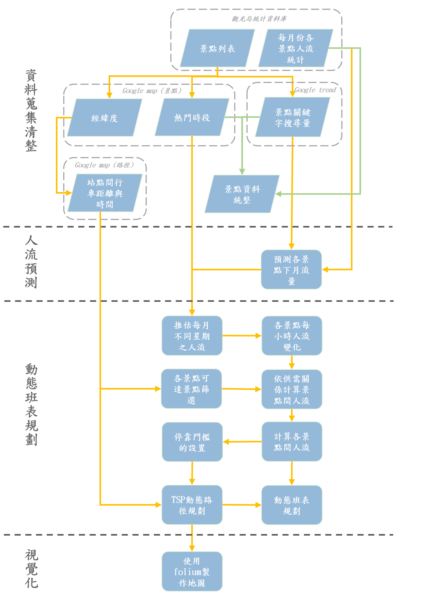

# Dynamic route and schedule planning for buses in Eastern Taiwan
本專案以花東地區為主，以建立一個動態班表與路徑規劃的方法為目標。相較於現在固定的班表與路線，我們希望透過透過結合 [google trends](https://trends.google.com.tw/trends/?geo=TW) 服務對應之景點關鍵字搜尋量預測隔月景點人流量，藉此我們可以透過前個月的搜尋量一定程度的去。景點對應的人流資料是使用[觀光局統計資料庫](https://stat.taiwan.net.tw/)的每月人流資料，。以此流量與 google map 上熱門景點資訊，可以分攤景點每月人流，藉此做後續的動態班表與路線規劃。

# Project Pipeline


# Folder schema
```
root
 |-- data 
 |-- data_processing
        |-- data
                |-- raw
                |-- process
                |-- final
        |-- sub_project
        |-- tool
        |- 0_get_touristflow_and_scenic-spots-info.ipynb
        |- 1_crawl_popular-time_from_google.ipynb
        |- 2_google_trend_data_select_by_deferred.ipynb
        |- 3_crawl_driving-distance(time)_between_two-points.ipynb

 |-- doc
 |-- DSRP
 |-- img
 |-- output
 |-- scripts
 |- main.py
```
- **`data`**: 底下包含動態路經與班表規劃所需的資料，是在 `data_processing` 整理好的。
- **`data_processing`**: 存放資料蒐集與前處理的資料夾， jupyter notebook 為前處理與資料蒐集的步驟，由開頭的數字可以知道前後順序。
  - **`data`**: 資料夾是專門存放資料處理時所產生的資料，因牽扯到許多不同的資料處理步驟，我們將資料分成 *`原始資料(raw)`*、*`中繼資料(process)`* 、*`最終資料(final)`* 三種資料，底下資料也可以根據開頭數字找到對應的 jupyter notebook。
  - **`sub_project`**: 使用到的子專案。
  - **`tool`**: 使用到其他工具。
- **`doc`**: 參考資料。
- **`DSRP`**: 本專案提出的主要方法，可以動態規劃路徑與班次，並且視覺化結果。
- **`img`**: github 上需要用到的圖片。
- **`output`**: 主要輸出的資料，包含路線、班表與視覺化結果。
- **`scripts`**: 一些自動化流程，主要使用 shell 格式。