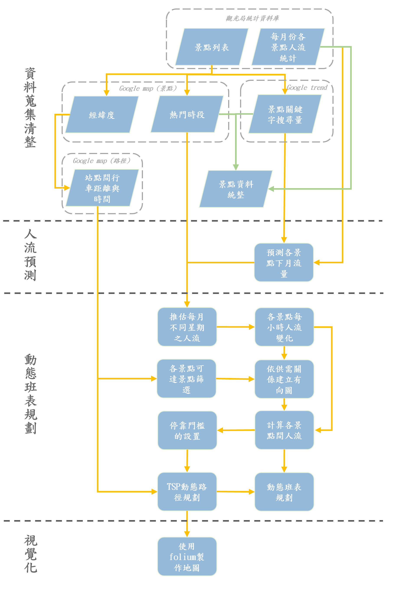

# Dynamic route and schedule planning for buses in Eastern Taiwan
本專案以花東地區為主，以建立一個動態班表與路徑規劃的方法為目標。相較於現在固定的班表與路線，我們希望透過透過結合 [google trends](https://trends.google.com.tw/trends/?geo=TW) 服務對應之景點關鍵字搜尋量預測隔月景點人流量，藉此我們可以透過前個月的搜尋量一定程度的去。景點對應的人流資料是使用[觀光局統計資料庫](https://stat.taiwan.net.tw/)的每月人流資料，。以此流量與 google map 上熱門景點資訊，可以分攤景點每月人流，藉此做後續的動態班表與路線規劃。

# Project Pipeline

# Folder schema
